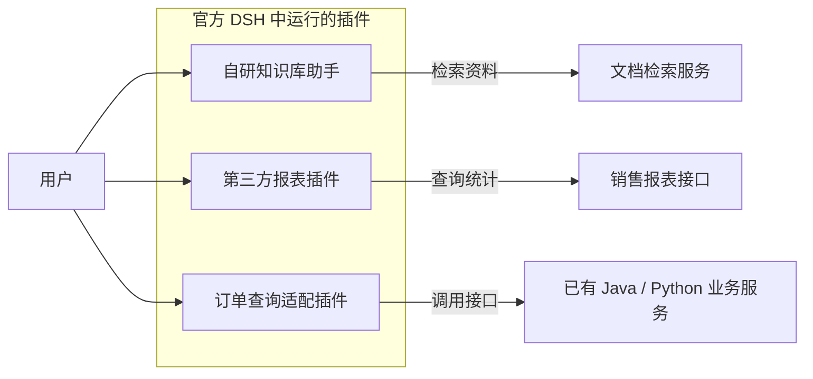
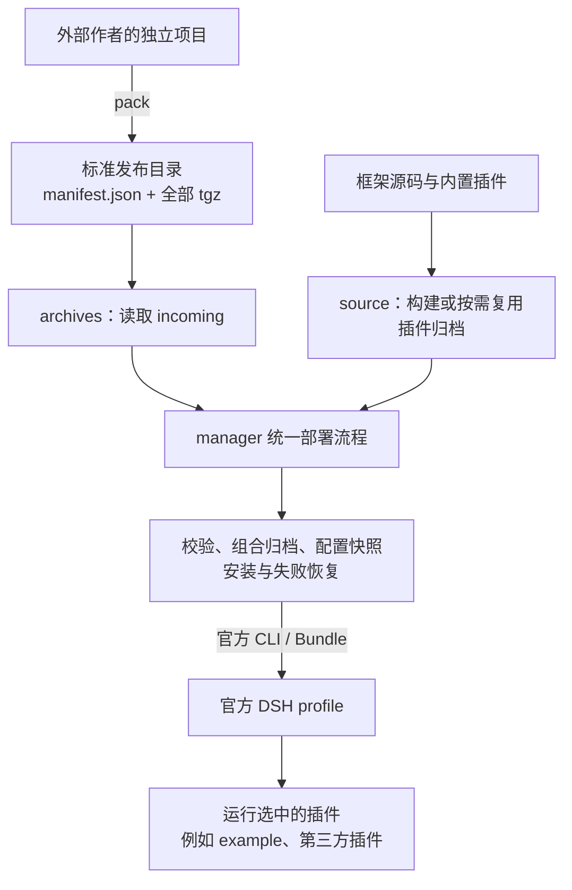

# DSH Plugin Manager

[English](README.en.md) · [为什么使用](#为什么使用) · [首次部署](doc/first-deployment.md) · [作者接入](doc/plugin-development.md) · [Releases](https://github.com/PelyDeng/dsh-plugin-manager/releases) · [反馈问题](https://github.com/PelyDeng/dsh-plugin-manager/issues)

基于 [DeepSeek Harness](https://github.com/deepseek-ai/deepseek-harness)（DSH）的插件管理与交付框架。用于统一打包、配置、安装和更新自己开发的 DSH 插件，也能接入符合交付规范的第三方插件，并通过插件连接已有项目或服务。

**业务项目独立开发，插件产物统一部署。** 作者在自己的仓库打包；部署者把完整发布目录放入 `incoming/`，执行框架 build 即可安装和启动选中的插件，无需作者源码。

> 社区维护的非官方项目，不代表 DeepSeek 官方产品或推荐。

## 为什么使用

当你基于 DSH 开发了多个业务插件，或需要接收其他团队交付的插件时，除了实现业务，还要处理打包、配置、登录授权、更新和失败恢复。本框架将这些公共工作集中维护，让每个项目沿用同一套交付与运维流程。

| 遇到的问题 | 本框架怎么处理 |
| --- | --- |
| 每个插件各写一套打包与部署脚本，交付方式不一致 | 用标准声明和 `pack` 生成完整发布目录，由统一 build 入口部署 |
| 插件作者与部署者绑在同一份源码仓库，交付时还要解释开发环境 | 外部项目独立维护源码、版本和锁文件；部署端使用产物和配套运行环境 |
| 多个插件重复实现登录、账号身份和应用授权 | 按需复用 auth 与 kit；业务插件仍负责接口保护和数据权限 |
| 更新时混入旧文件、漏掉其他插件，难以确认部署内容 | 校验清单、插件身份及归档摘要；显示新增、更新、保留与停用，缺包不自动当作停用 |
| 配置错误或发布中断后，不清楚该如何继续 | 保留操作记录和输入快照，提供原操作续作与同包业务配置修正的明确入口 |

源码部署也保留按需重建：只重建指定插件，其余归档在通过基线、输入和依赖检查后复用。官方 DSH 继续负责 Agent、模型、会话和插件运行，本框架补充应用交付与运维能力。

## 能接入哪些项目

插件可以来自自己的仓库，也可以由第三方提供。接入方式取决于项目形态，不能把“外部项目接入”理解为任意程序包都能直接托管。

| 你已有的项目 | 如何接入 |
| --- | --- |
| 自己开发的 DSH 插件 | 在框架 `plugins/*` 中开发，或放在独立仓库；按本框架规范声明、构建和打包 |
| 第三方 DSH 插件或官方 Bundle | 确认宿主兼容性并满足管理器声明、构建和发布物规范；已有合规完整发布目录可直接交付部署 |
| 普通 Node.js 项目 | 改造或封装为官方 Cordis 插件，提供 Bundle、插件入口和构建产物，再使用相同流程打包 |
| Java、Python 或已有 HTTP 服务 | 服务保持独立部署，由一个 DSH 插件调用其接口；框架管理这个适配插件，外部服务继续按原方式运维 |

当前直接打包支持独立 pnpm 单包。已有项目的适配步骤、最低声明和构建约束见[作者接入](doc/plugin-development.md)；普通源码 ZIP 或任意 npm tgz 不能代替标准发布目录。

## 场景示例：让多个项目在 DSH 中协同使用

假设团队已有文档检索服务、销售报表接口和订单系统，可以自研一个知识库助手，接入第三方提供的报表插件，再编写一个订单查询适配插件。用户在 DSH 中使用这些插件，已有服务继续在原环境运行：



例如，用户可以向对应插件提问“查找报销制度”“汇总本月销售额”或“查询订单进度”。这些业务工具需由插件作者实现；框架提供统一交付方式，DSH 提供 Agent 与模型能力，接入 auth/kit 的插件还可共用登录和授权。

三个插件可以拥有各自的仓库与版本，交付后由同一站点管理。更新其中一个时整体替换它的发布目录，并保留其他插件产物；如果多个插件由同一清单交付，则整体更新该清单对应的目录。

## 架构与部署流程

框架支持两种输入，共用一条部署流程：外部作者交付已经打包的插件，框架维护者也可以从源码构建。



- **产物部署（优先使用）**：作者在独立项目中用 `pack` 生成完整发布目录，部署者放入 `incoming/` 后执行框架 build。部署端不构建作者源码；`incoming/` 保留完整插件集合，漏包不会自动视为停用。
- **源码部署**：从框架源码准备宿主和插件产物，也可按需重建指定插件。其余插件只有通过成功基线、构建输入和依赖检查后，才会复用旧归档。
- **共用部署与恢复**：两种方式只在准备输入时不同，后续共用配置、安装、状态、锁和恢复实现。恢复使用已记录的输入或限定的同包业务配置修正，不自动回滚业务数据。

DSH 负责插件运行、Agent、模型与会话。manager 负责打包、配置、安装和运维，不导入业务源码。kit 按需提供身份、HTTP、工具与会话接口。

业务插件负责自己的功能与数据权限，声明权限不会自动保护业务接口。各部分的依赖方向和配置归属见[架构说明](doc/architecture.md)。

## 先部署别人交付的插件

从同一 [Release](https://github.com/PelyDeng/dsh-plugin-manager/releases) 取得 `dsh-plugin-manager-deployment-<版本>.zip`，解压后将完整插件发布目录放入 `incoming/<应用>/`。发布目录包含 `manifest.json` 和它引用的全部 `.tgz`，普通源码压缩包不能代替它。

准备 Node、本机 Linux Docker 引擎及 Compose、系统 tar。在解压目录执行：

```sh
bash build.sh
```

Windows PowerShell 使用 `.\build.ps1`。首次按提示填写确实需要的业务配置；需要统一登录时，把随包 `optional/auth` 复制到 `incoming/auth`。框架不会自动启动 example。完整操作、实际请求和目录替换步骤见[首次部署](doc/first-deployment.md)。

部署包携带管理器和固定运行镜像信息；运行依赖仍可能需要网络。不同宿主、架构与业务能力须按实际验证范围使用，构建或健康检查不等于业务已经验收。

## 开发自己的插件

从 `dsh-plugin-manager-starters-<版本>.zip` 选一个起步目录：

| 起点 | 适用场景 |
| --- | --- |
| [standalone-plugin](examples/standalone-plugin/README.md) | 先跑通公开探针，不需要 kit 或登录 |
| [standalone-kit](examples/standalone-kit/README.md) | 复用登录、授权和可信账号身份 |
| [完整问答应用](doc/plugin-development.md#复制完整问答应用到独立仓库) | 开发流式对话、历史和工具应用 |

随包 example 是开发者接入助手，可先体验框架问答、流式回答、会话历史与工具调用，再按指南复制为自己的问答应用。

<details>
<summary>查看 example 开发者接入助手界面</summary>


</details>

按[作者指南](doc/plugin-development.md)在独立工具目录安装固定版本的 manager，再打包自己的项目：

```sh
pnpm exec dsh-plugin-manager pack --root <作者项目绝对路径> --package . --output <新的发布目录>
```

pack 执行冻结安装、build、check 和归档校验，交付整个输出目录。当前直接支持独立 pnpm 单包；已有 Node 项目需满足插件入口与构建契约，其他语言服务可继续独立运行，由 DSH 插件调用其接口。

## 其他运行方式

| 目的 | 入口 |
| --- | --- |
| 从框架源码构建宿主与内置插件 | [源码部署](deploy/README.md#服务器源码发版)，原根 build 脚本与按需重建保持兼容 |
| 只安装 manager，手动组合并部署发布物 | 随包 [DELIVERY.md](packages/plugin-manager/DELIVERY.md)，不需要作者源码 |
| 体验 auth/example 的登录与问答 | [体验步骤](doc/getting-started.md)与[图文导览](doc/quick-tour.md) |
| 查字段、接口和故障 | [文档导航](doc/README.md) |

配置、持久数据和旧归档应沿用原站点。更新及失败时按[部署与恢复](deploy/README.md)操作；恢复不是业务数据回滚，也不能通过删除 `.local` 重新初始化来排错。

## 贡献与许可

公共库在 `packages/*`，内置业务插件在 `plugins/*`，独立示例在 `examples/*`。依赖方向见[架构](doc/architecture.md)。参见 [CONTRIBUTING.md](CONTRIBUTING.md)、[SECURITY.md](SECURITY.md)、[Apache-2.0](LICENSE) 和 [THIRD_PARTY_NOTICES.md](THIRD_PARTY_NOTICES.md)。
