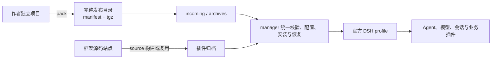

# DSH Plugin Manager

[English](README.en.md) · [部署已打包插件](#部署已打包插件) · [开发自己的插件](#开发自己的插件) · [作者指南](doc/plugin-development.md) · [部署指南](doc/first-deployment.md) · [Releases](https://github.com/PelyDeng/dsh-plugin-manager/releases)

基于 [DeepSeek Harness](https://github.com/deepseek-ai/deepseek-harness)（DSH）的插件交付与运维框架。插件作者在自己的项目里构建和打包，部署者只接收完整发布目录，不依赖作者源码。

> 社区维护的非官方项目，不代表 DeepSeek 官方产品或推荐。

## 先选择你的角色

| 角色 | 你要做的事 | 先看 | 不需要先处理 |
| --- | --- | --- | --- |
| 插件作者 | 编写、检查、打包插件 | [作者指南](doc/plugin-development.md) 和起步包 README | 站点恢复、数据迁移、服务器源码发版 |
| 部署者 | 安装、更新、验证插件 | [产物部署指南](doc/first-deployment.md) | 插件源码、作者构建工具链 |
| 站点维护者 | 维护源码站点、恢复失败发布、迁移数据 | [部署与管理](deploy/README.md) | 每个业务插件的内部实现 |

第一次使用不必读完所有文档。先完成下面两条最短路径之一，再按需要进入高级文档。

## 部署已打包插件

适用场景：作者已经交付包含 `manifest.json` 和全部 `.tgz` 的完整发布目录。

1. 从同一版本 [Release](https://github.com/PelyDeng/dsh-plugin-manager/releases) 下载 `dsh-plugin-manager-deployment-<版本>.zip` 并解压。
2. 把每个应用的完整发布目录放入 `incoming/<应用>/`。
3. 需要统一登录且发布目录未包含 auth 时，把随包 `optional/auth` 复制为 `incoming/auth`。
4. 在部署根执行：

   ```sh
   bash build.sh
   ```

   Windows PowerShell 执行 `.\build.ps1`。
5. 按 build 输出访问站点，并请求插件 README 声明的实际端点。

部署机器需要 Node.js、系统 tar、本机 Linux Docker 引擎及 Compose。普通源码 ZIP、单个 npm tgz 或只有前端 dist 的压缩包不能代替标准发布目录。完整配置、升级和恢复见[产物部署指南](doc/first-deployment.md)。

## 开发自己的插件

新建插件先从 Release 的 `dsh-plugin-manager-starters-<版本>.zip` 开始：

| 起步包 | 适用场景 |
| --- | --- |
| [standalone-plugin](examples/standalone-plugin/README.md) | 公开 readiness endpoint，不使用 kit 或登录 |
| [standalone-kit](examples/standalone-kit/README.md) | 复用登录、应用授权和可信账号身份 |

在作者项目之外创建独立工具目录并安装同版 manager：

```sh
pnpm init
pnpm add --ignore-workspace /absolute/path/plugin-manager-<版本>.tgz
```

在作者项目执行：

```sh
pnpm install --ignore-workspace
```

在工具目录执行：

```sh
pnpm exec dsh-plugin-manager list --root /absolute/path/my-plugin --package .
pnpm exec dsh-plugin-manager pack --root /absolute/path/my-plugin --package . --output .local/artifacts/release/v1
```

`pack` 会冻结安装、执行 build/check、校验归档并生成 `manifest.json`。交付整个输出目录，不要单独抽走 tgz。当前直接支持独立 pnpm 单包；npm、yarn 或 monorepo 不承诺相同的一步流程。

## 可以接入什么

| 已有项目 | 接入方式 |
| --- | --- |
| 自己开发的 DSH 插件 | 放在独立仓库或框架 `plugins/*`，按声明、构建和打包规范交付 |
| 第三方 DSH 插件或官方 Bundle | 确认宿主兼容性；已有合规完整发布目录可直接部署 |
| 普通 Node.js 项目 | 改造为官方 Cordis 插件，提供 Bundle 入口和构建产物 |
| Java、Python 或已有 HTTP 服务 | 服务继续独立部署，由一个 DSH 适配插件调用其接口 |

## 它不做什么

- 不把任意源码 ZIP、jar、前端 dist 或普通 npm 包自动变成可运行插件。
- 不因为插件声明了 permissions 就自动保护业务路由；访问控制和数据权限仍由插件实现。
- 不把构建、健康检查、登录或模型可用性混同于业务验收。
- 不自动回滚业务数据；更新前需要按数据所有者要求独立备份。
- 不要求部署者理解作者源码，也不在部署端构建作者项目。

## 架构分工



DSH 负责 Agent、模型、会话和插件运行。manager 负责打包、配置、安装、更新和恢复。kit 可选提供身份、HTTP、工具、模型和会话接口。业务插件继续负责自己的业务规则与数据权限。详细边界见[架构说明](doc/architecture.md)。

## 高级入口

| 目的 | 入口 |
| --- | --- |
| 体验 auth/example 登录和问答 | [登录与问答](doc/getting-started.md) · [图文导览](doc/quick-tour.md) |
| 查插件声明和实例配置 | [插件配置规范](doc/plugin-configuration.md) · [kit 文档](packages/plugin-kit/README.md) |
| 手工组合清单或直接管理宿主 | [独立 CLI 交付](packages/plugin-manager/DELIVERY.md) |
| 源码发版、按需复用、resume/recover | [部署与管理](deploy/README.md) |
| 查站点字段、凭据和默认值 | [框架配置](doc/framework-configuration.md) |
| 查故障和验证边界 | [FAQ](doc/FAQ.md) · [宿主兼容](doc/host-compatibility.md) · [验证记录](packages/plugin-manager/VERIFICATION.md) |
| 查全部文档 | [文档导航](doc/README.md) |

## 贡献与许可

公共库在 `packages/*`，内置示例插件在 `plugins/*`，独立起步包在 `examples/*`。参与开发前先读[贡献说明](CONTRIBUTING.md)和[架构](doc/architecture.md)。使用 [Apache-2.0](LICENSE) 许可，第三方来源见 [THIRD_PARTY_NOTICES.md](THIRD_PARTY_NOTICES.md)。
