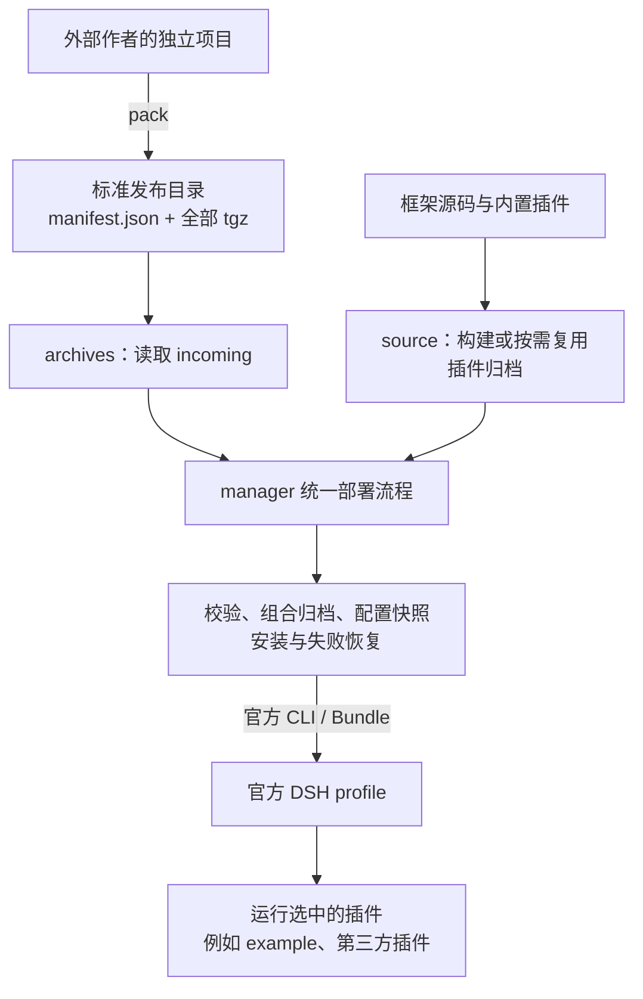

# DSH Plugin Manager

[English](README.en.md) · [首次部署](doc/first-deployment.md) · [作者接入](doc/plugin-development.md) · [Releases](https://github.com/PelyDeng/dsh-plugin-manager/releases) · [反馈问题](https://github.com/PelyDeng/dsh-plugin-manager/issues)

基于 [DeepSeek Harness](https://github.com/deepseek-ai/deepseek-harness)（DSH）的插件开发与部署框架。开发者在自己的项目中开发并打包；部署者把完整发布目录放进 `incoming/`，运行框架的 build 脚本即可安装和启动，无需作者源码。

例如，知识库助手和销售报表助手可以独立开发、分别更新，共用官方宿主及可选的账号系统。

> 社区维护的非官方项目，不代表 DeepSeek 官方产品或推荐。

## 架构与部署流程

框架支持两种输入，共用一条部署流程：外部作者交付已经打包的插件，框架维护者也可以从源码构建。



- **产物部署（优先使用）**：作者在独立项目中用 `pack` 生成完整发布目录，部署者放入 `incoming/` 后执行框架 build。部署端不构建作者源码；`incoming/` 保留完整插件集合，漏包不会自动视为停用。
- **源码部署**：从框架源码准备宿主和插件产物，也可按需重建指定插件。其余插件只有通过成功基线、构建输入和依赖检查后，才会复用旧归档。
- **共用部署与恢复**：两种方式只在准备输入时不同，后续共用配置、安装、状态、锁和恢复实现。恢复使用已记录的输入或限定的同包业务配置修正，不自动回滚业务数据。

DSH 负责插件运行、Agent、模型与会话。manager 负责打包、配置、安装和运维，不导入业务源码。kit 按需提供身份、HTTP、工具与会话接口。

业务插件负责自己的功能与数据权限，声明权限不会自动保护业务接口。各部分的依赖方向和配置归属见[架构说明](doc/architecture.md)。


## 先部署别人交付的插件

从同一 [Release](https://github.com/PelyDeng/dsh-plugin-manager/releases) 取得 `dsh-plugin-manager-deployment-<版本>.zip`，解压后将完整插件发布目录放入 `incoming/<应用>/`。发布目录包含 `manifest.json` 和它引用的全部 `.tgz`，普通源码压缩包不能代替它。

准备 Node、本机 Linux Docker 引擎及 Compose、系统 tar。在解压目录执行：

```sh
bash build.sh
```

Windows PowerShell 使用 `.\build.ps1`。首次按提示填写确实需要的业务配置；需要统一登录时，把随包 `optional/auth` 复制到 `incoming/auth`。框架不会自动启动 example。完整操作、实际请求和目录替换步骤见[首次部署](doc/first-deployment.md)。

部署包携带管理器和固定运行镜像信息；运行依赖仍可能需要网络。不同宿主、架构与业务能力须按实际验证范围使用，构建或健康检查不等于业务已经验收。

## 开发自己的插件

从 `dsh-plugin-manager-starters-<版本>.zip` 选一个起步目录：

| 起点 | 适用场景 |
| --- | --- |
| [standalone-plugin](examples/standalone-plugin/README.md) | 先跑通公开探针，不需要 kit 或登录 |
| [standalone-kit](examples/standalone-kit/README.md) | 复用登录、授权和可信账号身份 |
| [完整问答应用](doc/plugin-development.md#复制完整问答应用到独立仓库) | 开发流式对话、历史和工具应用 |

按[作者指南](doc/plugin-development.md)在独立工具目录安装固定版本的 manager，再打包自己的项目：

```sh
pnpm exec dsh-plugin-manager pack --root <作者项目绝对路径> --package . --output <新的发布目录>
```

pack 执行冻结安装、build、check 和归档校验，交付整个输出目录。当前直接支持独立 pnpm 单包；已有 Node 项目需满足插件入口与构建契约，其他语言服务可继续独立运行，由 DSH 插件调用其接口。

## 其他运行方式

| 目的 | 入口 |
| --- | --- |
| 从框架源码构建宿主与内置插件 | [源码部署](deploy/README.md#服务器源码发版)，原根 build 脚本与按需重建保持兼容 |
| 只安装 manager，手动组合并部署发布物 | 随包 [DELIVERY.md](packages/plugin-manager/DELIVERY.md)，不需要作者源码 |
| 体验 auth/example 的登录与问答 | [体验步骤](doc/getting-started.md)与[图文导览](doc/quick-tour.md) |
| 查字段、接口和故障 | [文档导航](doc/README.md) |

配置、持久数据和旧归档应沿用原站点。更新及失败时按[部署与恢复](deploy/README.md)操作；恢复不是业务数据回滚，也不能通过删除 `.local` 重新初始化来排错。

## 贡献与许可

公共库在 `packages/*`，内置业务插件在 `plugins/*`，独立示例在 `examples/*`。依赖方向见[架构](doc/architecture.md)。参见 [CONTRIBUTING.md](CONTRIBUTING.md)、[SECURITY.md](SECURITY.md)、[Apache-2.0](LICENSE) 和 [THIRD_PARTY_NOTICES.md](THIRD_PARTY_NOTICES.md)。
