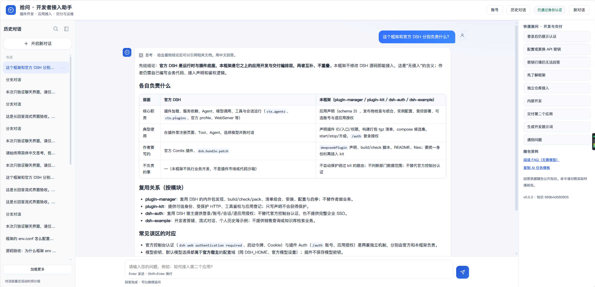

# DSH Plugin Manager

[English](README.en.md) · [图文导览](doc/quick-tour.md) · [部署指南](doc/first-deployment.md) · [Releases](https://github.com/PelyDeng/dsh-plugin-manager/releases) · [反馈问题](https://github.com/PelyDeng/dsh-plugin-manager/issues)

**基于 DeepSeek Harness 的 AI 应用开发与部署框架，让个人开发者和小团队开发自己的插件，并统一安装、更新和管理。**

你可以基于 [DeepSeek Harness](https://github.com/deepseek-ai/deepseek-harness) 生态，在自己的仓库开发各类插件和 AI 应用，例如知识库助手、报表助手、业务工具或带独立页面的智能体应用。框架提供统一的接入约定、打包、安装、更新、配置和启停管理，支持将多个插件组合部署，供自己使用或交付给团队与客户。

沿用官方 Cordis 插件、Bundle 和 Agent 机制，无需修改 DSH 或管理器源码；插件可以独立开发和打包，发布运行端无需作者源码，并可按需复用统一登录与应用访问授权，减少重复开发和运维工作。接入需遵循框架支持的插件声明，并验证目标宿主版本的兼容性。

> 社区独立维护的非官方项目，不代表 DeepSeek 官方产品或推荐。



已有 Linux Docker 环境？从[首次部署](doc/first-deployment.md)开始，完成“登录 → 授权 → 配置模型 → 首次问答”。只想先看效果，请看[图文导览](doc/quick-tour.md)。

| 你想做什么 | 从这里开始 |
| --- | --- |
| 先运行一个应用，看看登录和问答页面 | [快速体验](#快速体验) |
| 在自己的仓库开发插件或智能体应用 | [独立仓库开发](doc/plugin-development.md#独立仓库开发) |
| 在本仓库增加或维护插件 | [内部工作区开发](doc/plugin-development.md#内部工作区开发) |
| 部署别人交付的插件包 | [发布物交付指南](packages/plugin-manager/DELIVERY.md) |

## 目录

- [项目能力](#项目能力)
- [界面预览](#界面预览)
- [与官方 DSH 的关系](#与官方-dsh-的关系)
- [快速体验](#快速体验)
- [开发自己的插件](#开发自己的插件)
- [部署与更新](#部署与更新)
- [常见问题](#常见问题)
- [文档与目录](#文档与目录)
- [贡献与许可](#贡献与许可)

## 项目能力

| 能力 | 解决的问题 |
| --- | --- |
| 独立仓库接入 | 作者维护自己的 pnpm 单包项目，通过声明接入，不改管理器名单 |
| 内部插件扫描 | 保留 `plugins/*` 自动发现、选集与批量构建，不要求内部插件迁出仓库 |
| 通用构建与打包 | 按插件声明执行 build、必要 check 和 pack，输出清单与归档 |
| 发布物组合 | 将多个作者的交付目录组合成站点发布物，release 运行端无需作者源码 |
| 配置与受控启停 | 管理实例配置、安装、启动、停止和已声明的就绪探针 |
| 可选统一认证 | 复用账号、登录和应用访问授权；业务接口由作者显式接入 kit |

例如知识库助手和销售报表助手可以共用账号与交付流程，各自实现检索、接口、页面及数据权限。可信身份不等于业务数据许可，应用仍需检查用户能读取哪些文档或报表。

## 界面预览

内置 `dsh-example` 是开发者接入助手，展示提问、流式回答、个人历史和可选认证的接入方式。

登录、模型设置与问答步骤见[图文导览](doc/quick-tour.md)。实际问答需先配置自己的模型凭据。

## 与官方 DSH 的关系

| 部分 | 负责什么 |
| --- | --- |
| 官方 DSH | Cordis 插件运行、Bundle 组合、Agent、模型与会话 |
| 本框架 | 作者接入约定、发布物组合、配置和交付管理，以及可选基础认证 |
| 业务插件 | 工具、页面、业务参数、数据授权与业务验收 |

个人只运行一个工具时，直接使用官方 Bundle 可能更简单。需要统一打包、安装、更新和管理自己的插件，或将多个应用交付给团队与客户时，可以复用本框架的管理能力。插件安装和更新通过管理器 CLI 与部署流程完成；认证页面负责账号和应用访问授权。它不承诺所有社区插件或任意宿主版本自动兼容；作者需要说明并验证支持的宿主版本。

## 快速体验

### 第一步：选择运行方式

| 方式 | 适合谁 | 入口 |
| --- | --- | --- |
| Node CLI 图文体验 | Windows PowerShell 或 Bash 用户，希望了解打包、登录与运行过程 | [准备工具和目录](doc/getting-started.md#1-准备工具和目录) |
| Linux Docker 一键部署 | 已有 Linux 服务器，希望运行完整源码站点 | [一键部署](doc/first-deployment.md) |

Node 路径需要 Node.js `^22.19.0 || >=24`、pnpm `11.19.0` 和系统 `tar`，无需 Docker。Linux Docker 路径取得完整仓库源码并满足环境要求后，在仓库根执行：

```sh
bash deploy/build.sh
```

脚本生成本机配置、构建宿主及插件并启动，默认访问 `http://127.0.0.1:7902`。远程浏览器访问方式及失败恢复见一键部署文档。

### 第二步：登录并打开示例

访问 `/auth`，完成首次管理员改密，创建普通账号并授予 example 权限，再用普通账号打开 `/example`。完整步骤及截图见[登录并体验问答](doc/getting-started.md#4-登录并体验问答)。

### 第三步：完成一次问答

使用默认 DeepSeek 提供方时，管理员在 `/auth` 的“模型设置”录入 API 密钥，无需重启；页面只显示配置状态与不可逆指纹。默认模型选择或其他提供方仍由同一实例的官方模型设置管理。随后在 `/example` 新建对话，确认收到流式回答并能恢复历史。详细操作见[模型准备](packages/plugin-manager/DELIVERY.md#问答应用的模型准备)。

## 开发自己的插件

### 独立仓库开发

按[作者指南](doc/plugin-development.md#独立仓库开发)取得管理工具、复制示例、填写声明并保存锁文件。在已安装 manager 的工具目录执行：

```sh
pnpm exec dsh-plugin-manager list --root /path/to/author-project --package .
pnpm exec dsh-plugin-manager pack --root /path/to/author-project --package . --output .local/artifacts/release
```

把路径换成自己的作者根目录；输出路径相对于该根目录。`pack` 冻结安装依赖，依次执行一次 build、一次 check 和打包，交付时无需预先重复执行 build/check。

| 起点 | 适用场景 |
| --- | --- |
| [最小独立 Bundle](examples/standalone-plugin/README.md) | 不需要 kit，先验证插件声明与发布物交付 |
| [统一身份示例](examples/standalone-kit/README.md) | 复用登录和应用授权，读取当前账号身份 |
| [完整问答应用](doc/plugin-development.md#复制完整问答应用到独立仓库) | 在流式对话、历史和知识示例上开发自己的应用 |

当前外部入口支持 pnpm 单包项目和 release 部署，不提供外部 workspace 自动发现或 development/link。

### 内部工作区开发

继续在 `plugins/*` 下开发。在本仓库根执行：

```sh
pnpm install --frozen-lockfile
pnpm list:plugins
pnpm package --plugins "auth,example" --output .local/artifacts/release/plugins
```

内部扫描、批量任务及 development/link 均保留。日常构建、检查和测试的选择见[内部开发步骤](doc/plugin-development.md#内部工作区开发)。普通构建和测试不需要初始化宿主子模块、配置模型密钥或启动 Docker。

## 部署与更新

消费外部交付包时，按[发布物交付指南](packages/plugin-manager/DELIVERY.md)完成：**取得各应用清单与归档 → 组合完整候选集合 → 填写实例配置 → 启动 → 用普通账号验证业务**。运行端无需作者源码，要求登录的应用必须与认证 provider 一同选入候选清单。

更新时保留原始分项发布目录，替换目标应用后重新组合全部需要保留的应用；沿用实例 home，并按指南备份、停止和启动。两应用演练见[加入第二个应用](doc/getting-started.md#进阶加入第二个应用)。

使用 Linux 完整源码部署时，更新仓库后仍执行 `bash deploy/build.sh`。该入口直接使用已有官方源码，不主动拉取或要求匹配预设版本，默认无需镜像仓库。配置与恢复说明集中在[部署文档](deploy/README.md)。

## 常见问题

首次登录、官方控制台认证、服务器录入模型密钥及问答排错见 [FAQ](doc/FAQ.md)。

| 问题 | 说明 |
| --- | --- |
| 新插件必须修改 DSH 或管理器源码吗？ | 不需要；按支持的包声明与扩展接口接入 |
| 写完声明就能保护接口吗？ | 不能；作者需显式接入 kit，业务数据权限也由应用检查 |
| 包名可以直接从 npm 安装吗？ | 本文包名不代表已经公开发布；先取得版本化工具 tgz |
| 构建时会运行全部业务测试吗？ | check 只做必要编译、类型或语法检查；完整测试由作者单独运行 |
| kit 升级后所有应用自动生效吗？ | kit 内嵌于各应用，消费它的应用需要更新版本并重新打包 |
| 接入或启动遇到问题怎么办？ | 先读[排错入口](doc/getting-started.md#命令速查与求助)和[开发者 FAQ](plugins/dsh-example/knowledge/guide.md) |

## 文档与目录

按使用目标查阅[文档导航](doc/README.md)。需要让 AI 协助开发时，可复制[开发提示词](plugins/dsh-example/knowledge/prompts.md)。

| 位置 | 用途 |
| --- | --- |
| [packages/plugin-kit](packages/plugin-kit/README.md) | `@dsh-plugin-manager/plugin-kit`：身份、权限、HTTP、工具登记 |
| [packages/plugin-manager](packages/plugin-manager/README.md) | `@dsh-plugin-manager/plugin-manager`：发现、打包、安装和受控启停 |
| [plugins/dsh-auth](plugins/dsh-auth/README.md) | 可选账号、登录与插件授权 |
| [plugins/dsh-example](plugins/dsh-example/README.md) | 开发者答疑、流式对话、历史与可选认证示例 |
| [integrations/docker](integrations/docker/README.md) | 官方宿主镜像与 Compose 集成 |
| [deploy](deploy/README.md) | Bash、PowerShell、Node 入口和配置模板 |
| `.local/data/` | 本机持久数据，不进入 Git |
| `.local/artifacts/` | 发布归档与恢复记录，不进入 Git |

## 贡献与许可

参见 [CONTRIBUTING.md](CONTRIBUTING.md)、[SECURITY.md](SECURITY.md)。本仓库自有代码采用 [Apache-2.0](LICENSE)，第三方归属见 [NOTICE](NOTICE) 和 [THIRD_PARTY_NOTICES.md](THIRD_PARTY_NOTICES.md)。本项目由社区维护，不是 DeepSeek 官方发布渠道。
