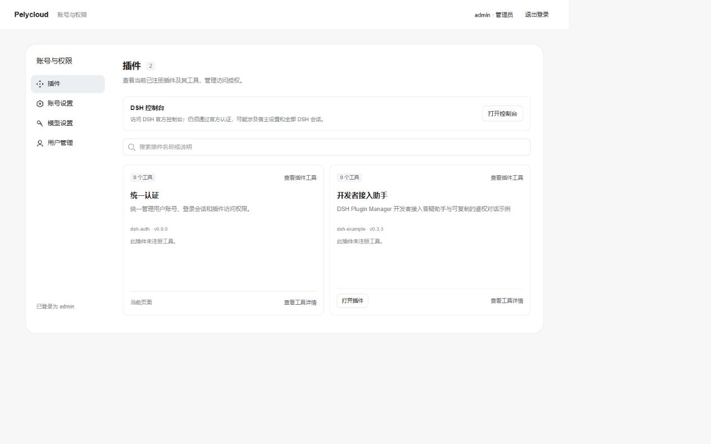
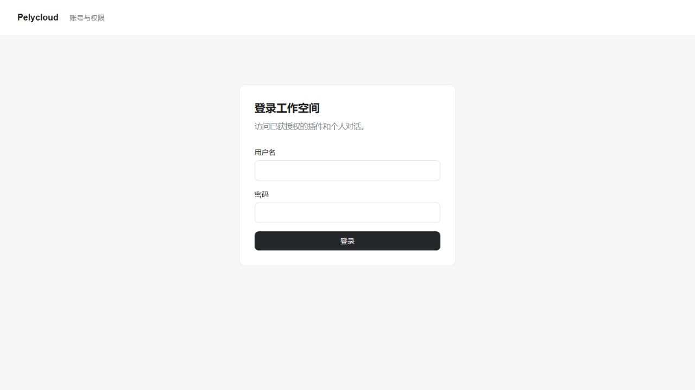

<!-- Generated from doc/getting-started.md.tmpl by scripts/version.mjs; edit the template. -->

# 体验登录、授权与首次问答

本页聚焦 auth/example 的实际使用。先按[产物一键部署](first-deployment.md)运行站点；手工 Node CLI 部署见随包 [DELIVERY](../packages/plugin-manager/DELIVERY.md)。开发自己的插件直接读[作者指南](plugin-development.md)，不必先构建完整问答应用。

## 1. 准备工具和目录

普通使用者从框架 **0.16.2** 的发行附件取得部署包和 public-apps.zip。public-apps 中的完整目录同时包含 auth/example；复制到 incoming/public-apps 后，不要再复制 optional/auth，以免重复 ID。

仅维护者从源码准备 manager/kit 时，在框架根安装锁定依赖，再执行：

```sh
pnpm --filter @dsh-plugin-manager/plugin-kit build
pnpm --filter @dsh-plugin-manager/plugin-manager build
pnpm --filter @dsh-plugin-manager/plugin-manager pack --out .local/artifacts/plugin-manager-0.16.2.tgz
pnpm --filter @dsh-plugin-manager/plugin-kit pack --out .local/artifacts/plugin-kit-0.16.2.tgz
```

这些是工具构建，不启动站点。需要源码部署的维护者见[源码入口](../deploy/README.md#服务器源码发版)。

## 2. 打包第一个应用

使用已发布 public-apps 无需再次打包。要修改 example 时按[内部开发](plugin-development.md#内部工作区开发)打包；独立应用使用起步包和作者指南，完成后把完整输出交给部署者。

## 3. 配置并启动

在部署根执行 `bash build.sh`，Windows 执行 `.\build.ps1`。准备真实必需参数，核对输出地址；更改公网地址需同步 origin、URL 与 trusted hosts。完整配置和更新只在首次部署指南维护。



## 4. 登录并体验问答

<!-- excerpt:first-login -->
需要认证的应用先确认已选入并启用 auth，再访问实际站点的 /auth；无认证应用跳过登录。空数据库首次管理员为 admin，初始密码 123456；首次登录按页面强制改密，然后重新登录。此后创建普通账号，为它勾选目标插件授权，再用该普通账号登录。

鉴权起步插件的实际请求为 /independent-access-example/identity，成功返回含 owner 的 JSON；匿名或无该应用授权的账号不应取得身份结果。无 kit 的起步插件请求 /independent-example/ready，成功返回其 README 定义的就绪 JSON。测试身份端点不需要模型。

已部署 example 时，普通账号打开 /example；尚未配置模型可点击“阅读 FAQ（无需模型）”，指南仍需应用授权，但不创建 Agent 或调用模型。配置自己的模型后新建对话，确认真实流式回答及历史恢复。/auth 登录、官方根路径认证和模型 API 密钥分别管理，不能用填模型密钥修复根路径的认证提示。健康检查、登录和真实模型调用分别验证。
<!-- /excerpt:first-login -->



密钥和默认模型见[框架配置](framework-configuration.md#密钥由谁管理)。图文操作见[图文导览](quick-tour.md)，实际模型报错见 [FAQ](FAQ.md)。

## 进阶：加入第二个应用

新应用的完整发布目录放到 incoming 后再 build，默认全选会发现它；显式选集需要加入其 ID。需要认证的应用确保仍有一个启用的 provider，已有 public-apps 中的 auth 无需重复添加。管理员为普通账号增加新应用授权，再分别验证旧新应用。

更新按[完整目录替换](first-deployment.md#更新与恢复)操作；手动 CLI 的 previous/manifest 语义见 DELIVERY，不能混用两条流程。

## 登录、配置与停用

实例 enabled/accessMode 由[插件配置](plugin-configuration.md)定义。普通用户登录不等于拥有全部业务数据，插件仍应验证数据范围。账号、会话、配置和数据沿用原站点，不通过删除 .local 排错。

## 命令速查与求助

初次部署与更新用 build；原输入暂时失败用 resume；同包业务配置修正用 recover，见[运维入口](../deploy/README.md#安装与恢复)。提问附版本、操作系统、目录角色、脱敏错误和预期结果，不发送配置全文、Cookie、token 或客户数据。
