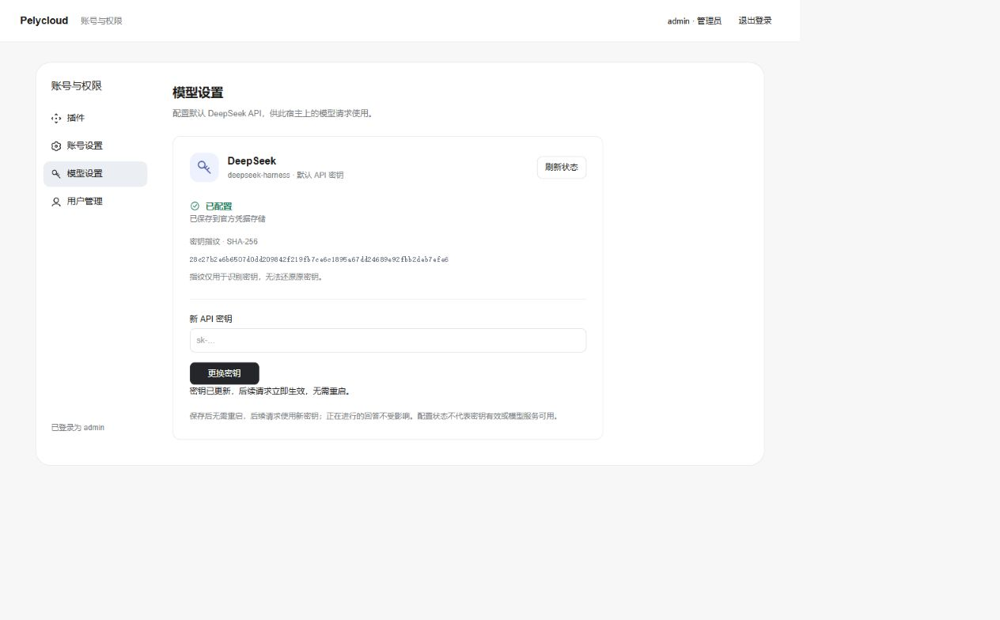
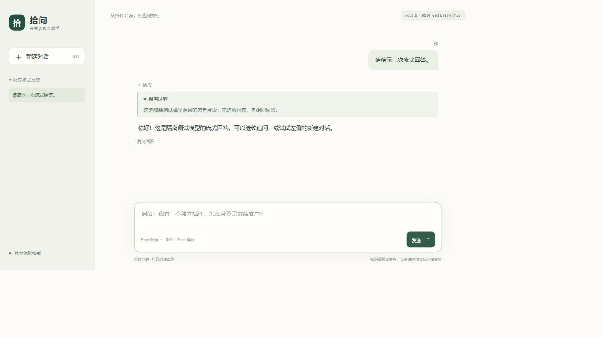

# 从登录到首次问答：DSH Plugin Manager 图文导览

这是基于 DeepSeek Harness 的 AI 应用开发与部署框架。个人开发者和小团队可以在自己的仓库开发各类插件，通过管理器 CLI 和部署流程统一打包、安装、更新与管理，供自己使用或交付给他人。

本页演示启用可选认证后的登录与问答流程：管理员管理账号、应用访问权限和默认 DeepSeek 密钥，普通用户进入已授权的应用。插件开发和安装更新分别见[作者指南](plugin-development.md)与[发布物交付指南](../packages/plugin-manager/DELIVERY.md)。

[开始 Linux Docker 部署](first-deployment.md) · [English introduction](../README.en.md) · [完整 CLI 体验](getting-started.md) · [FAQ](FAQ.md)

## 1. 登录独立的应用门户

从 `/auth` 进入。首次管理员登录需要修改初始密码，再继续账号和应用管理。

插件账号登录与官方控制台根路径 `/` 的认证独立。看到 `dsh web authentication required` 时，应使用官方启动生成的认证地址；填写模型 API 密钥不能解决这个认证提示。

## 2. 给账号授权应用

管理员在“用户管理”创建普通账号、设置应用授权；用户在“插件”页打开已授权的应用。应用内部的数据权限仍由业务插件检查。

## 3. 配置默认 DeepSeek 密钥

管理员打开“模型设置”，录入自己的 API 密钥。保存或更换后，后续请求无需重启即可使用新密钥；页面只显示状态和 SHA-256 指纹，不返回原密钥。指纹用于比较是否更换，不是可还原的加密密钥。

“已配置”表示凭据存在，不代表余额、网络、提供方授权或实际模型调用已经通过。其他提供方和默认模型选择在官方模型设置中处理。服务器也可通过[交互式脚本](first-deployment.md#首次登录与模型密钥)录入；脚本和网页复用同一凭据操作。

## 4. 在应用里完成问答

用已授权的普通账号打开 `/example`，点击快捷问题或输入自己的问题，观察流式回答。刷新后从左侧历史继续会话。

截图使用演示数据和测试模型，界面文案以安装版本为准。实际问答需要自己的模型凭据。

## 下一步

- 运行站点：[首次部署及恢复](first-deployment.md)。
- 写自己的插件：[最小独立 Bundle](../examples/standalone-plugin/README.md)，或[统一身份示例](../examples/standalone-kit/README.md)。
- 交付现有应用：[源码之外的发布物交付](../packages/plugin-manager/DELIVERY.md)。
- 反馈问题：提供版本、复现步骤和脱敏报错，提交到 [Issues](https://github.com/PelyDeng/dsh-plugin-manager/issues)。
