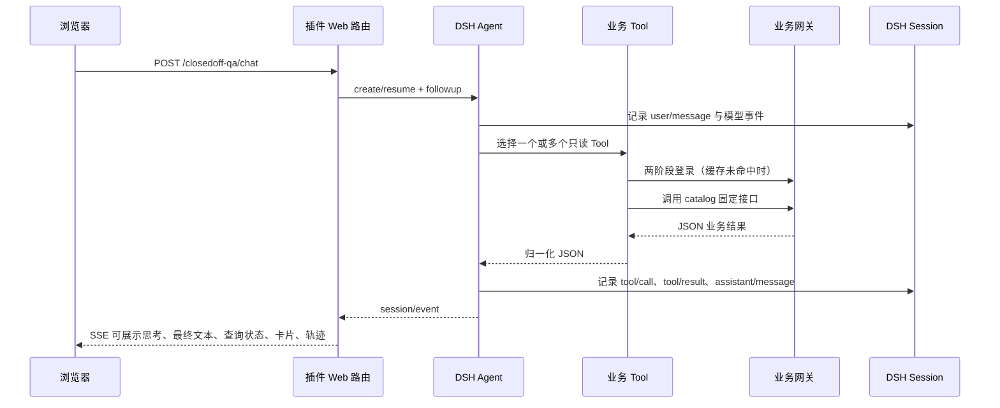

# 架构与实现边界

## 摘要

本包负责把园区接口接到 DSH。DSH 负责运行 Agent、模型和会话，本包通过公开的 Cordis 插件、Tool、Agent、Session 和 Web Server 接口完成业务查询与页面展示。这个分层使 DSH 上游更新与业务接口变化可以分别处理。

## 组件职责

| 组件 | 所有者 | 职责 |
| --- | --- | --- |
| `cordis.patch.yml` | 本包 | 向 `web` profile 插入一个插件实例，并传入非机密部署参数 |
| `src/env.ts`、`env.conf` | 本包 | 读取并校验网关地址与两阶段认证参数；真实文件由用户维护，不进入 Git 和发布快照 |
| `src/specs.ts` | 本包 | 定义 37 个允许访问的业务查询、参数、适用问题和分析关注点 |
| `src/gateway.ts` | 本包 | 使用已校验的私有参数完成两阶段登录、token 缓存、请求限制和响应归一化 |
| `src/tools.ts` | 本包 | 把 catalog 转成 DSH Tool，并注册到 `ctx.tools` |
| `src/redaction.ts` | 本包 | 对模型可见结果、卡片和旧历史正文执行确定性脱敏 |
| `src/agent.ts` | 本包 + DSH | 为专用页面创建或恢复 Agent；限定 persona、模型选择和 Tool allowlist |
| `src/conversation-store.ts` | 本包 | 持久化账号归属和历史列表摘要，正文继续由 DSH 保存 |
| `src/web.ts` | 本包 + DSH | 在 `ctx.webServer` 注册静态页面、历史、SSE 对话、回答反馈、会话分支与停止路由 |
| `src/presentation.ts` | 本包 | 只读取持久 session event，整理成页面历史、卡片和轨迹点 |
| `src/fences.ts` | 本包 | 解析围栏标绘，向实时页面与历史恢复提供完整边界和不可展示提示 |
| `web/index.html`、`web/app.css` | 本包 | 定义专用页面的语义骨架和视觉规则，不承载业务事件处理 |
| `web/app.js` | 本包 | 管理会话、SSE 事件、思考与 Tool 状态、卡片、回答操作和历史恢复 |
| `web/trajectory.js` | 本包 | 封装轨迹三维、串行自动截图、全屏手动截图、设备组和摄像头播放器生命周期 |
| Agent Loop / LLM | DSH | 组织回合、调用模型、执行 Tool、产生结构化 session event |
| Session Persistence | DSH | 保存并恢复对话事件，不由本包另建聊天数据库 |

## 一次问答的数据流

专用页面以 Tool 的服务端展示元数据生成业务卡片和轨迹。专用 Agent 要求页面可展示的查询规划、工具选择、异常判断和结果分析使用中文。服务端按思考步骤维护可发布文本，只发送以中文句末标点或换行结束的稳定前缀；`assistant/message` 只释放当前步骤的剩余文本，`turn/end` 才标记整轮思考完成。投影会移除 opaque 结果值、长标识值以及标识字段语境中的短数字值，并以 250ms 为上限发送去重的完整快照；历史 API 使用同一投影恢复可展示思考，不返回原始推理事件。页面将思考与 Tool 状态分开，思考默认收起，Tool 状态始终可见。

完成回合从持久事件投影最终助手消息 ID、`turn/end` 序号、模型用量、首字延迟、总用时和完成时间。页面据此显示 DSH 风格的回答操作栏。赞/踩通过 `messageFeedback` 服务写入独立 sidecar，不进入模型上下文或会话事件；再次点击当前评价会删除评价。会话分支只允许选择已完成回合，使用截止对应 `turn/end` 的事件前缀创建新的命名空间会话，并记录父会话标识；原会话保持不变。

卡片按固定业务主题聚合并负责可核对事实，模型正文只解释结论、异常、风险和建议；存在结构化结果时，页面确定性移除重复 Markdown 表格。历史投影保留每轮 `turn/end` 的结束原因；`aborted`、`interrupted`、`max-tokens`、`blocked` 和 `error` 使用独立状态提示，即使已有部分正文也明确标记回答未完整结束。

只有真正返回 `data`、`empty`、轨迹或媒体结果时才说明上方查询结果已保留，加载和失败占位不计为已返回结果；实时流与历史恢复使用同一映射，且状态提示不会被后续 `done` 清除。没有显式卡片定义的 Tool 只从自身 `result.fields` 按声明顺序生成通用卡片，并使用自己的 Schema 说明作为标签；opaque ID、媒体、标绘配置、轨迹点和嵌套原始数据禁止自动展示。

空结果保留在已执行来源的紧凑状态中；接口返回数据但没有安全可展示字段时保留“已返回数据”的事实和专用说明，不生成空卡片，也不把限定时间范围内无数据表述为历史上从未存在。

新会话通过 kit `conversationModel()` 使用官方框架默认模型；恢复与分支通过官方 `sessionProjections.modelSelection` 保留记录中的模型与推理等级，读取失败拒绝恢复。新会话仅在模型声明支持时采用插件 `reasoningEffort`（默认 `low`），否则沿用官方默认，避免向不兼容模型发送推理参数。车辆“所有信息”查询使用明确的八项基础查询清单，并仅在电子运单返回预约 ID 时追加预约详情，避免反复规划或遗漏模块。

“在园车辆最新位置”是当前状态工具，只在用户明确询问当前在园或所在位置时调用。“最近”、“历史”或“所有信息”不自动引入该工具；其结果是服务端缓存的最新位置，不构成无延迟实时定位承诺。

带时间过滤的 Tool 在 catalog 中明确声明起止字段对。网关只补齐用户实际使用的时间字段对，保留合法输入的时分秒，并按该 Tool 的 `maxDays` 限制真实持续时长；同时包含入园和出园字段的接口不会因只查询其中一组而被自动附加另一组条件。分页上限继续使用插件现有的全局配置，不在 Tool 间改变查询容量。

## Tool 返回字段契约

`src/specs.ts` 的每个 Tool 同时声明 `result.dataKind` 和分析所需的主要字段。`src/tools.ts` 从这份声明生成运行时 `output.schema`、简短返回字段提示和模型可见结果白名单。标准 envelope、`result.fields`、明确登记的嵌套字段和后续详情查询必需的 opaque ID 可以进入模型；未知附加字段不会进入模型消息。设备页面需要但不应提示给模型的字段登记在 `runtimeFields`，完整轨迹和媒体数据只通过服务端展示元数据交给专用页面。

`src/presentation.ts` 为高频业务 Tool 保留人工定义的字段选择和主题聚合；其余 Tool 使用上述 `result.fields` 作为唯一通用卡片来源，不遍历运行时对象的未知字段。两种路径都执行相同的脱敏和不可展示字段限制，因此新增 Schema 字段只有在该 Tool 没有人工卡片定义且字段不属于禁止集合时才自动进入页面。

成功、业务失败和传输失败用 `ok` 判别。成功结果允许 `data=null`；业务对象允许增加未知字段，已知字段不设为必填，也不根据当前旧代码猜测值类型。只有后端 Controller/VO、前端实际使用或脱敏实测能够证明 `data` 基数时才使用 `list`、`object` 或 `paged-object`，证据不足的外部微服务接口保留 `unknown`。这使 Schema 能发现列表与对象串位等结构错误，同时不把微服务独立升级误判为 Tool 失败。

白名单分页的身份和联系字段在模型与页面投影前统一脱敏。设备的 `accessAddress` 和 `videoAddress` 仅作为页面播放所需的运行字段，不进入模型结果。

预约详情返回的 `specificData` 由 `typeCode` 决定实际结构：`0` 为预约主体，`1`、`2` 为审批信息，`3` 为司机自检数组，`4` 为园区抽查对象及其 `securityCheckList`。模型和卡片投影按这五种结构分别选取字段；未知阶段或未登记嵌套字段不会进入模型消息。

车辆轨迹 Tool 并行查询轨迹接口和一次固定为 `pageIndex=1`、`pageSize=500` 的设备分页接口。轨迹和设备完整响应都保存在同一个 Tool 结果元数据中供页面投影使用，模型只接收已转换时间、点位数量、按路线先后排列的附近设备组、起终点附近设备组和最长驻留估算。即使 DSH 对大型 Tool 正文执行截断或溢出文件存储，实时页面和会话恢复仍从结构化元数据取得完整点位，不依赖不完整的模型正文。投影层按 `groupId` 聚合设备，采用设备组继承的第一个有效标绘点作为组点位，并按设备 ID 或编码去重；没有有效标绘点的设备组不进入地图。投影层计算设备组点到每条轨迹线段的最短距离，只向页面发送配置半径内的设备组。

沿途分析按设备组最接近的轨迹线段确定先后顺序。驻留估算只累计相邻两个轨迹点都位于同一设备组配置半径内的连续时段，并排除超过 `trackDwellMaxGapSeconds` 的采样间隔；结果不能证明车辆停止或被对应设备识别，模型必须提示结合摄像头抓拍核验。设备接口失败时，轨迹仍可展示，但 Tool 摘要明确说明沿途设备组和驻留分析不可用。

轨迹点不超过 800 个时原样展示；更长轨迹均匀抽样为 800 个点并强制保留首尾点，避免终点和自动取景范围丢失，同时维持既有页面数据量上限。

`closedoff_control_area_page` 和 `closedoff_plotting_config_one` 将完整结果保存在 Tool 展示元数据中，模型只取得业务字段与可展示边界数量，不接收原始标绘 JSON。`src/fences.ts` 同时支持列表接口直接返回的 `plottingConfigData` JSON 字符串、嵌套 `plottingConfigData.plottingData` 和单记录接口的 `plottingData`；标绘可以是图层数组或单对象。

仅投影 `WallLayer.fences[].positions` 和 `PolygonLayer.polygons[].positions`，同时接受这两种图层直接保存的 `positions`。围栏使用保存的顶点高程和墙体高度，不套用模型校高偏移；缺少墙体高度时只绘边界线，不推断墙高。不同围栏独立绘制，不连接不同片区；任何无效顶点使对应图形不可展示，页面明确提示涉及的记录数。围栏不做轨迹式抽样，保留完整边界。

实时 `fences` 事件和历史 `fences[callId]` 共用相同的纯投影。页面在园区设施卡片旁显示三维截图，复用轨迹的串行队列、模型校高、自动取景、全屏交互与 PNG 保存。旧历史仅在实际保存了可解析标绘时恢复地图，无法恢复时提示重新查询。接口返回成功不代表浏览器三维资源已经加载成功，模型摘要与页面加载状态分别表达。

问答正文和三维轨迹弹窗共用公共 CesiumJS `1.142.0`、地形服务、3D Tiles、轨迹点和设备组数据，不依赖私有 GIS 封装包。正文轨迹进入串行截图队列，任一时刻最多创建一个临时 Viewer；页面等待自动取景完成，并在同一渲染帧确认 `tileVisible` 后到达 `postRender`，再生成 JPEG 场景截图、替换画布并立即销毁 Viewer。

新的设备组数据会使尚未完成的旧任务失效并重新入队，历史恢复也使用同一队列，因此多条轨迹不会同时长期占用 WebGL。正文截图和弹窗根据轨迹、起终点及已筛选设备组计算相同的完整取景范围，使用相同的 `maximumScreenSpaceError = 2` 模型细化精度，并保留设备组图标与名称；起点和终点标记同时显示对应轨迹点的时间，点位没有时间时只显示端点名称。

三维弹窗在用户点击“全屏查看”后创建独立的可交互 Viewer；弹窗瓦片就绪后才启用“截图并保存”，保存时短暂锁定相机输入并把当前视角导出为 PNG，不移动相机、不替换画面也不销毁 Viewer。关闭、重绘或重置按 Viewer 代际取消旧保存任务，避免历史瓦片事件修改新 Viewer。

两个流程都通过 `Cesium3DTileset` 加载模型，根据部署配置沿 tileset 中心的椭球法向设置 `modelMatrix` 高度偏移后再取景。这个顺序保持 `depthTestAgainstTerrain` 开启，同时避免地形与模型高程基准不一致造成的穿模。Fuling 当前以 `60m` 作为浏览器差分校准值；该值只属于当前数据集。页面从本地 Cesium 资源加载 `NaturalEarthII` 底图；该底图不包含园区卫星影像，模型周边的绿色区域需要由业务系统使用的卫星影像图层补齐，不应通过继续抬高模型处理。

两个轨迹视图都在地图旁显示可滚动的设备组名称和摄像头数量，并同时支持点击地图标记或设备组列表打开摄像头详情。页面按 `deviceType = 6` 过滤并展示组内摄像头详情。设备投影保留 `videoAddress` 和 `accessAddress`，页面优先使用后端在 AI 直播可用时写入的 `accessAddress`，没有该值时回退到 `videoAddress`，并通过 `@hy-media/video-player@0.0.37` 播放 WebSocket FLV、HLS 或 MP4。

车辆抓拍接口的媒体地址保存在展示元数据中，并通过独立媒体事件或历史投影交给同一播放器；普通卡片、模型正文和播放器信息区都不显示原始地址。设备组数据包含有效流地址时，页面在浏览器空闲时加载并初始化播放器运行资源；视频流连接仍延迟到用户打开摄像头详情。切换摄像头或关闭弹窗会卸载播放器并释放流连接。播放器的原始 npm 包快照由本插件 `vendor/` 版本化保存并仅作为构建依赖；正式插件携带复制后的运行资源。CesiumJS 和播放器运行资源由插件本地提供，地形、3D Tiles、业务影像图层和视频流由配置的外部服务提供。

## 持久化和恢复

浏览器只保存符合 `closedoff-web-<UUIDv4>` 的 `conversationId`，本地编号按当前身份分开。服务重启后，历史接口先检查 SQLite 中的归属，再要求 `ConversationManager` 通过 DSH persistence 恢复相同 session，从持久保存的事件日志重建页面。浏览器不能提交任意 DSH session ID，也不能指定未知 ID 创建或认领会话。

Agent handle 是进程内资源；销毁 handle 会移除活动对象，不等于删除磁盘 session 日志。专用页面不维护第二套消息表，避免 DSH 日志和业务页面历史不一致。

进程内 handle 达到配置上限时，只淘汰最久未使用且没有正在回答的 handle；持久 session 仍可在下一次访问时恢复。正在回答的会话不会被容量回收。

## 认证与个人历史

`DSH_ACCESS_MODE` 通过 bundle 配置映射为 `accessMode`，取值为 `standalone` 或 `authenticated`，默认独立模式。认证模式要求配置 `DSH_PUBLIC_ORIGIN` 为对外完整 origin，并加载兼容的认证提供者；没有登录返回 401，没有插件授权返回 403，认证提供者不可用返回 503，不能自动切换独立模式。页面登录跳转到 `/auth`，公共 HTTP 组件集中执行路由授权和变更请求来源校验。

所有 37 个工具统一要求 `closedoff:access`。运行目录从实际工具定义登记名称、描述和参数，在 auth 的“已注册插件”中展示。全局工具执行入口在调用业务网关前和返回结果前复核权限；认证模式没有绑定身份的官方或外部 Agent 无法调用它们。该授权只表示可以使用封闭化插件，不定义园区或企业级数据权限。

`$DSH_HOME/plugins/closedoff/conversations.sqlite` 保存会话 ID、身份命名空间、用户 ID、创建和更新时间以及历史标题，不复制聊天正文。归属先保留，DSH Agent 创建成功后才发布索引；创建失败或进程中断留下的未完成索引不可访问，不自动认领。历史列表在服务端按归属分页查询。用户的不同浏览器共享同一用户 ID，登录会话 ID 不写入历史归属，因此退出或重启不改变记录主人。

运行中的 Agent 和 SSE 绑定发起该回合的具体登录会话。同一用户另一登录可读取历史，但正在回答时不能重新绑定身份。退出、密码修改、账号停用、授权撤销或认证提供者卸载会取消对应回合并关闭流；输出前仍复核授权，定时检查的间隔由 `authRecheckMs` 配置，默认为 1000 毫秒。连接关闭不代表 Agent 已结束，只有 DSH 的 `turn/end` 才释放活动状态，防止未结束工具被另一次登录重新授权。

独立模式使用安装级 `standalone:local` 身份，不提供浏览器之间的多用户隔离；其新记录与账号用户的私有记录分开。移除 auth 不删除数据库或 DSH 日志，也不公开账号用户的历史。升级前没有归属的历史保留为未分配数据，不自动划给管理员或第一个提供 UUID 的用户。首次回退旧无鉴权版本必须关闭旧业务入口或使用上线前独立快照挂载，不能让旧版挂载新增私有会话的数据目录。

`/closedoff-qa/health` 是公开存活探针，仅返回服务状态；部署探针 `/closedoff-qa/ready` 额外检查认证提供者的可用性，认证模式缺失提供者时返回 503。`/closedoff-qa/identity` 和业务 API 仍检查当前用户的实际访问权限。

## 凭据与日志

插件激活时从 `CLOSEDOFF_ENV_CONF` 指向的文件读取私有参数；未指定路径时读取插件根目录的 `env.conf`。文件必须提供网关地址和六个认证字段，解析结果只保存在插件进程内存中。token 仅在内存中缓存；修改 `env.conf` 后需要重新加载插件或重启服务。认证参数和请求体不会写入 session event，Tool 返回只包含接口路径、成功状态、业务数据、分页字段、时间范围说明和耗时。

模型最终正文先在服务端缓冲完整消息，再一次性执行递归脱敏并发送给页面；历史恢复再次使用同一脱敏逻辑。这样不会因为流式分片跨越手机号、身份证号或媒体地址边界而漏脱敏。媒体地址只保留在播放器所需的展示元数据中。

## 源码职责索引

| 变化 | 通常修改位置 | 是否修改 DSH 主仓 |
| --- | --- | --- |
| 新增或调整业务查询 | `src/specs.ts`、对应测试、persona/README | 否 |
| 业务认证协议变化 | `src/gateway.ts`、gateway 测试 | 否 |
| 页面骨架或样式变化 | `web/index.html`、`web/app.css` | 否 |
| 会话交互或卡片渲染变化 | `web/app.js`、`src/presentation.ts` | 否 |
| 轨迹三维、截图或摄像头变化 | `web/trajectory.js`、`src/presentation.ts` | 否 |
| 新增业务写操作 | 独立 Tool、权限/审批/审计设计、测试与文档 | 通常否，但不能直接复用当前只读策略 |
| DSH Tool/Agent/Session API 破坏性升级 | 本包适配层 | 否，除非上游本身缺少必要扩展点 |
