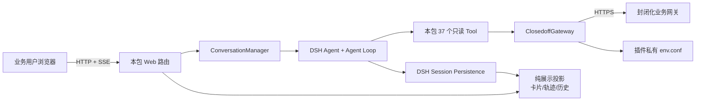

# DSH 封闭化管理智能助手

通过插件管理器部署时，遵循[插件运行配置规范](../../doc/plugin-configuration.md)。在 `<DSH home>/plugins/closedoff/plugin.json` 中用 `enabled` 启停插件，用 `accessMode: authenticated|standalone` 切换认证；默认要求登录。修改后执行同一 `apply-compose` 命令，站点 origin、健康检查和挂载由管理器统一处理。`env.conf` 保留为业务配置，不因认证切换改写。以下直接 Bundle 配置方式适用于自行启动宿主的场景。

## 摘要

`dsh-closedoff-assistant` 是独立于 `deepseek-harness` 主仓的 DSH profile bundle。它把封闭化园区接口封装成 37 个只读 Tool，为每个浏览器会话创建独立的 DSH Agent，并在 `/closedoff-qa` 提供面向业务人员的问答页面、可展示思考、工具执行状态、数据卡片与车辆轨迹地图。

本包不修改 DSH 源码。DSH 负责模型、Agent Loop、Tool 调度、会话日志和 Web Server；本包负责业务知识、接口映射、私有业务配置、安全限制以及专用页面。

支持明确选择的独立运行和统一认证模式。启用认证后，页面通过 `/auth` 登录，全部业务 API 和工具要求 `closedoff:access`，历史对话按账号隔离；不安装 auth 时可使用独立模式。身份、存储及旧数据规则见 [认证与个人历史](doc/architecture.md#认证与个人历史)。

流式呈现兼容旧版 `assistant/chunk` 与 DSH 0.1.3 的 `agent/assistant-stream`。新版历史使用运行时官方 `expandAssistantStream` 展开 message/attempt 中的记录，保留思考预览、工具提示、失败或取消的部分输出和首 token 时间；瞬时帧不写入持久化事件。开发依赖仍固定在已发布 SDK，版本差异集中在 `src/assistant-stream.ts`。

## 目录

- [功能范围](#功能范围)
- [架构关系](#架构关系)
- [本地构建](#本地构建)
- [安装到 DSH](#安装到-dsh)
- [配置业务参数](#配置业务参数)
- [启动与访问](#启动与访问)
- [开发模式与正式模式](#开发模式与正式模式)
- [开发与升级](#开发与升级)
- [限制与安全边界](#限制与安全边界)

## 功能范围

- 预约审批、预警报警、车辆综合信息、出入记录、实时位置、历史轨迹、电子运单、黑白名单、停车区与设备等 37 个查询 Tool。
- 两阶段业务认证、token 内存缓存、鉴权失效后单次重试；修改私有配置后通过插件重载生效。
- `pageSize`、时间范围、请求体、响应体、接口超时、Agent 回合时长和并发会话限制。
- 时间字段按 Tool 声明的起止对处理，保留用户时分秒；长轨迹在保留首尾点的前提下最多向页面投影 800 个点。
- 每段车辆轨迹及其全屏视图在顶部突出显示结果中的车牌号，保留起止时间；实时结果与历史恢复使用同一车牌字段，缺失时显示“车牌未知”。
- 车辆轨迹 Tool 同时查询设备列表，按轨迹先后返回附近设备组、起终点附近设备组和最长驻留估算；完整点位与设备响应通过展示元数据交给页面，模型只接收已格式化的分析摘要。
- 电子围栏列表和单个围栏标绘 Tool 自动展示三维场景截图，可全屏交互并保存当前视角；实时结果与历史恢复共用轨迹的地形、3D Tiles、串行截图队列与资源释放。支持保存的围栏墙和多边形边界，保留完整坐标与围栏高度；无效或不支持的标绘明确提示，不补画边界。
- 同一回答的结构化结果按车辆概览、授权与名单、通行、轨迹、预约与运单、风险等业务主题聚合；卡片展示事实，最终正文只补充结论、异常、风险和建议。
- 专用 Agent 要求页面可展示的查询规划、工具选择、异常判断和结果分析使用中文。专用页面将经服务端脱敏、按完整语句发布并限频的可展示思考放在默认收起的独立行中；下方 Tool 状态常显且不受思考折叠影响。页面不发送不稳定的生成尾部或原始模型推理；存在结构化结果时还会移除最终正文中的重复 Markdown 表格。
- 完整回答底部提供与 DSH 对话页一致的复制、赞/踩、从该回合创建新对话、用量详情、耗时详情和完成时间。赞/踩写入 DSH 消息反馈 sidecar；创建分支复用截止该回合的持久事件，不修改原会话。
- 若查询结果已经返回但结论汇总被用户停止或连接中断，页面会保留结果并明确提示该轮已中断；历史恢复时沿用同一提示，不把空正文误显示成一次完整分析。
- 37 个 Tool 共用可校验的成功/业务失败/传输失败结果 envelope，并按当前代码证据声明 `data` 基数和主要业务字段；模型可见结果使用 fail-closed 字段投影，手机号、身份证号和媒体地址在进入模型或普通卡片前脱敏。
- “在园车辆最新位置”只用于明确的当前状态问题；该接口返回缓存最新值，不表述为无延迟实时坐标。
- 浏览器会话使用 `closedoff-web-<UUID>` 命名空间，服务端同时检查持久化的会话归属，不能读取其他用户或其他 DSH 会话。
- 达到进程内会话上限时只回收最久未使用的空闲 handle，不删除持久会话，也不打断正在回答的会话。
- 对话正文通过 DSH session persistence 保存，历史列表及归属保存在本插件 SQLite 索引中；服务重启或更换浏览器后登录相同账号可恢复个人历史。
- 页面资源均由本包本地提供，不依赖 CDN。
- 视频播放器默认开启 AI 识别框，并提供开启／关闭按钮；画框依赖视频流携带的 SEI 识别数据，开关只控制前端识别框显示，不启停后台算法。

## 架构关系



详细职责和数据流见 [doc/architecture.md](doc/architecture.md)。

全部 37 个查询 Tool、业务接口、参数、响应、认证、配置和提示词见 [doc/tool-api-reference.md](doc/tool-api-reference.md)。

## 本地构建

要求 Node.js `^22.19.0` 或 `>=24.0.0`，并安装 pnpm 11。

```powershell
Set-Location '<dsh-plugin-gitee 仓库目录>'
pnpm install --frozen-lockfile
pnpm check
```

`pnpm build` 会生成 `dist/`，把 `web/app.css`、`web/trajectory.js`、`web/app.js` 以及固定为 `1.142.0` 的公共 CesiumJS 浏览器资源、设备组标记图片、DSH Think/API 图标和 `@hy-media/video-player@0.0.37` 运行资源复制到 `web/assets/`。`index.html` 只保留语义页面骨架，主交互由 `app.js` 管理，轨迹三维、自动截图队列、全屏截图和摄像头播放器由 `trajectory.js` 统一管理。轨迹地图和视频播放器均不使用公网 CDN。

`@hy-media/video-player@0.0.37` 的版本化 npm 包快照保存在本插件的 `vendor/`，本包通过相对 `file:` 开发依赖安装，不再访问原私有 npm 源。CesiumJS 和其余公开依赖仍从公共 npm 源安装。正式插件 `.tgz` 携带复制到 `web/assets/` 的播放器运行资源，不依赖仓库外目录。

## 安装到 DSH

已安装 `dsh` 命令时，在本包目录执行：

```powershell
dsh plugin --profile web add .
```

从 `deepseek-harness` 源码运行时执行：

```powershell
$pluginRoot = (Get-Location).Path
Set-Location '<deepseek-harness 仓库目录>'
pnpm dsh plugin --profile web add "file:$pluginRoot"
```

上面的源码安装命令应从插件包根目录开始执行，因此 `$pluginRoot` 会自动使用当前电脑上的实际位置。

该命令把本包作为 profile 依赖安装，并自动把 `cordis.patch.yml` 加入 `web` profile 的 bundle 层。无需改动 `deepseek-harness/packages/` 或官方 profile 模板。

## 配置业务参数

用户运行配置保存网关地址与两阶段认证参数；通过主仓部署器启动时默认位置为 `.local/data/dsh-home/plugins/closedoff/env.conf`。在主仓根从公开模板创建文件并自行填写：

```powershell
New-Item -ItemType Directory -Force .local/data/dsh-home/plugins/closedoff | Out-Null
Copy-Item plugins/dsh-closedoff-assistant/env.conf.example .local/data/dsh-home/plugins/closedoff/env.conf
```

`env.conf` 包含 `CLOSEDOFF_BASE_URL`、阶段一 `clientId/clientSecret`，以及阶段二 `appCode/clientId/clientSecret/username`。插件每次激活时读取并校验该文件；缺失文件、空字段、非 HTTPS 网关地址都会使插件明确启动失败。

真实 `env.conf` 由用户维护，不进入 Git、tgz 或镜像；[env.conf.example](env.conf.example) 仅提供字段模板。部署配置可以覆盖文件位置，启动时通过 CLOSEDOFF_ENV_CONF 传入路径。

## 启动与访问

专用业务 Agent 默认使用 `low` 推理等级，避免查询型任务继承 DSH 全局的高推理等级而产生冗长思考和额外等待；部署环境可用 `CLOSEDOFF_REASONING_EFFORT` 在 `off`、`low`、`high`、`max` 中调整。轨迹地图默认读取插件配置中的地形与 3D Tiles 地址。部署环境可分别通过 `CLOSEDOFF_TERRAIN_URL` 和 `CLOSEDOFF_TILESET_URL` 覆盖这两个地址，并通过 `CLOSEDOFF_TILESET_HEIGHT` 设置模型沿椭球法向的高度偏移（米）；当前 Fuling 数据经浏览器差分检查后的默认值为 `60`。`CLOSEDOFF_TRACK_DEVICE_RADIUS_METERS` 设置设备组到轨迹线的最大距离，默认 `100` 米；`CLOSEDOFF_TRACK_DWELL_MAX_GAP_SECONDS` 设置驻留估算允许累计的最大相邻采样间隔，默认 `300` 秒，超过该值的间隔按定位中断排除。正文三维视图和三维弹窗都根据轨迹、起终点和筛选后的设备组自动计算完整取景范围。浏览器必须能直接访问目标服务，目标服务也必须允许跨域读取。更换数据集或定位采样策略时必须重新标定高度、设备组距离和驻留间隔，不能照搬当前默认值。

推荐通过仓库统一启动脚本启动；脚本从运行配置映射解析文件位置，再把路径传给开发或正式安装的插件：

```powershell
Set-Location '<dsh-plugin-gitee 仓库目录>'
.\deploy\scripts\start.ps1 -Plugin closedoff -Mode development
```

直接运行已经安装的 profile 时，设置的只是配置文件路径，正式值仍从文件读取：

```powershell
$env:CLOSEDOFF_ENV_CONF = (Resolve-Path '<用户配置目录>\env.conf').Path
dsh --profile web
```

浏览器打开 DSH 输出的 Web 地址，再追加 `/closedoff-qa`。例如 DSH 显示 `http://127.0.0.1:<port>/` 时，访问 `http://127.0.0.1:<port>/closedoff-qa`。

## 开发模式与正式模式

本包通过仓库统一启动脚本切换模式。切换前先停止当前 DSH 服务，然后在仓库根目录执行：

```powershell
# 开发模式：link 安装并加载 HMR patch
.\deploy\scripts\start.ps1 -Plugin closedoff -Mode development

# 正式模式：tgz 发布快照安装，不加载开发 patch
.\deploy\scripts\start.ps1 -Plugin closedoff -Mode release -HarnessRoot deepseek-harness
```

开发模式默认查找插件主仓内部的 `deepseek-harness` 官方子模块；发布模式也可显式选择该源码宿主，否则使用已安装的 dsh。目录布局不同时传入仓库位置：

```powershell
.\deploy\scripts\start.ps1 -Plugin closedoff -Mode development -HarnessRoot '<deepseek-harness 仓库目录>'
```

开发模式会以 `link:` 方式接入 DSH，并通过 [dev/dev-hmr.patch.yml](dev/dev-hmr.patch.yml) 启用 Cordis 模块 HMR。再打开另一个终端，在插件包根目录启动持续构建：

```powershell
pnpm dev
```

此后修改 `src/` 下的 TypeScript 文件会重建 `dist/index.mjs`；修改 `web/index.html`、`web/app.css`、`web/trajectory.js` 或 `web/app.js` 会同步第一方页面资源并刷新服务端持有的插件。Cordis 只卸载并重新加载本插件，不重启 DSH 进程。页面文件不是浏览器 HMR 模块，因此修改页面后仍需手动刷新浏览器，但不需要重启服务。

HMR 会释放旧插件注册的路由、Agent 和正在响应的 SSE 流，开发时应在智能体空闲时保存代码。修改 `package.json`、依赖、Bundle 列表或安装版本仍需重启；profile 与 home 的 `cordis.patch.yml` 配置继续由 DSH 自身热加载。

正式模式会先生成 `.tgz` 发布快照，将其保存到主仓的 `.local/artifacts/<操作ID>/plugins/`，再从该快照安装本包，不加载开发 HMR patch，也不指向开发工作区。开发模式和正式模式共用 profile、模型设置与用户维护的运行配置；切换只改变依赖来源及启动 patch，不修改 DSH 主仓源码。跨模式切换需要一次服务重启，此后开发模式内的普通源码与页面改动不再需要重启。

## 开发与升级

在本插件目录修改源码后，先构建再检查：

```powershell
pnpm build
pnpm check
dsh plugin --profile web add .
```

如果 profile 使用的是本地 link，按“开发模式与正式模式”启动后重新构建即可；如果安装结果是复制快照，再执行一次 `add .` 并重启。版本发布前更新 `package.json` 版本，在主仓执行 `pnpm check --plugins closedoff`，提交源文件、文档和 lockfile，真实 `env.conf` 留在用户配置目录，不提交 `dist/`、`web/assets/` 等生成物。播放器升级时更新 本插件 `vendor/` 下的快照和本包 `file:` 依赖，确认没有有效引用后删除旧快照。

DSH 上游升级时，先在单独测试 profile 中安装本包并运行 `--dump-default-config` 或启动冒烟；只有 DSH 插件 API、session event、bundle patch 或 Web Server API 改变时才需要调整本包。正常业务 Tool 增减只修改本包。

业务前后端升级后还应重新核对 `src/specs.ts` 的 `result`：先确认接口的 `data` 是列表、对象、内嵌分页对象还是未定结构，再核对模型分析所需字段。对象允许服务端增加字段，已知字段也不要求每条记录都存在；没有源码或脱敏响应证据的接口保持 `unknown`，不能按接口名猜测并收紧。

设备、地图或播放器需要但不应提示给模型的字段登记在 `result.runtimeFields`。常用业务 Tool 继续使用 `src/presentation.ts` 的显式展示定义；没有显式定义的 Tool 只从自身 `result.fields` 按声明顺序生成通用卡片，并采用该 Tool Schema 的字段说明作为标签。opaque ID、媒体、标绘配置、轨迹点和嵌套原始数据不会自动进入卡片；接口确有数据但没有安全可展示字段时，页面明确提示该状态，不生成空白“记录”卡片。

文档和命令示例不得写入开发者电脑的盘符或用户目录；使用仓库相对路径、当前目录命令或 `<插件包目录>` 一类明确占位符。

## 限制与安全边界

- 当前 37 个接口全部是查询接口；本包没有审批、放行、删除或其他写操作。
- `baseUrl` 必须是 HTTPS。服务端只访问 Tool catalog 内声明的固定路径，不接受模型或浏览器传入任意 URL。
- Agent 的自然语言答案可能产生解释错误；关键审批、报警处置和车辆管控决定必须回到业务系统核验。
- 查询详情所需的 opaque ID 可以保留给模型完成后续只读调用，但不会进入普通卡片；未知响应字段、完整手机号、身份证号和媒体地址不会进入模型可见结果。
- 轨迹页面展示接口返回的轨迹点，并按设备列表中的 `groupId` 聚合已标绘设备组；没有有效标绘点或到任一轨迹线段的最短距离超过配置阈值的设备组不会显示。轨迹连线只连接离散历史点，不代表业务系统提供了连续定位。
- 轨迹 Tool 内部只查询一次设备列表，并把附近设备组按其最接近的轨迹线段排序。最长驻留位置只累计首尾点都落在同一设备组配置半径内、且相邻采样间隔没有超过配置上限的连续时段；这是离散定位点估算，不是停车事实，需用摄像头抓拍或业务记录核验。
- 问答正文自动显示 Cesium 三维场景截图；多条轨迹按队列逐张生成，任一时刻最多创建一个临时 Viewer，截图完成后立即销毁以释放 WebGL 资源。正文截图与大屏弹窗使用同一套地形、3D Tiles、轨迹、设备组、完整取景和模型精度。用户点击“全屏查看”后可交互操作独立 Viewer；弹窗当前视角的三维瓦片完成可见渲染后，可点击“截图并保存”把 PNG 保存到本机，保存操作不会销毁或改变弹窗 Viewer。
- 点击三维地图中的设备组标记或右侧设备组名称，会打开该组的摄像头详情。详情只包含 `deviceType = 6` 的摄像头，不展示 IP 广播或电源保障终端；设备接口返回 `videoAddress` 或 `accessAddress` 时使用园区定制播放器播放，两个字段都缺失时明确展示无可用视频地址。页面在收到含有效流地址的设备组后利用浏览器空闲时间预热本地播放器运行资源，视频流仍只在用户打开摄像头详情时连接。
- 轨迹地图直接使用公共 CesiumJS `1.142.0` 加载地形和 3D Tiles，并使用其本地 `NaturalEarthII` 默认底图，不依赖 `@prism-next/core`。默认底图不是园区卫星影像；模型周边出现绿色区域不等于 tileset 未加载，当前提供的地形和 3D Tiles 地址之外还缺少业务系统使用的卫星影像图层。要复现业务系统中的连续地表画面，必须另行取得并配置该影像服务。
- 地形与 3D Tiles 由外部数据服务提供。页面在 tileset 加载后先应用可配置高度偏移，再飞到模型，并保持地形深度检测开启。`layer.json` 可访问不代表地形可用；排障时还应抽查其声明的 `.terrain` 瓦片。CesiumJS 不能修复数据服务的 404、跨域、证书错误或缺失的数据内容。
- 开发依赖固定在 DSH `0.1.2-alpha.5`，兼容范围以 package.json 为准。DSH 仍处于 alpha 阶段，升级前必须执行本包检查和隔离 profile 冒烟。
