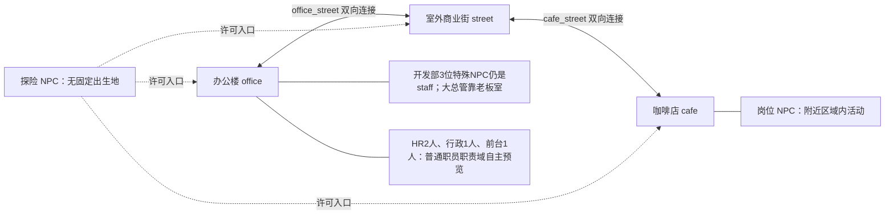
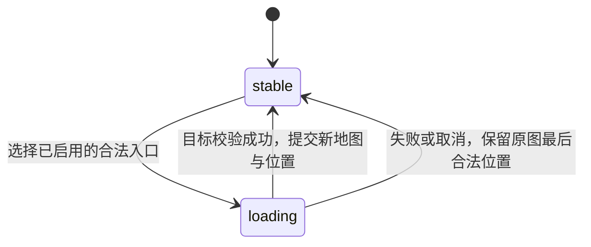
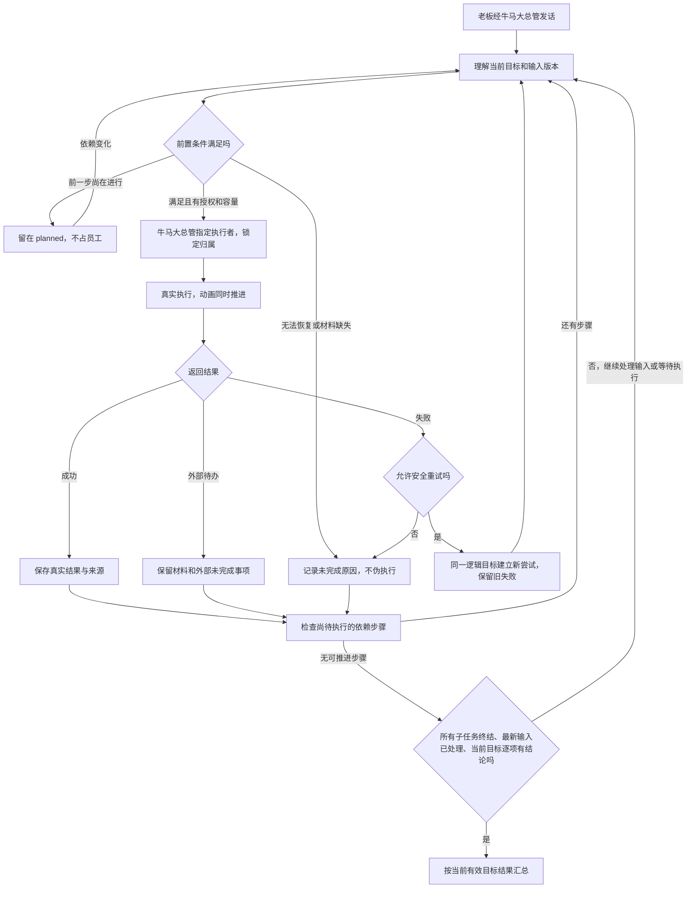
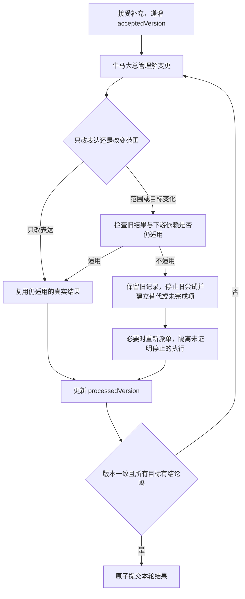
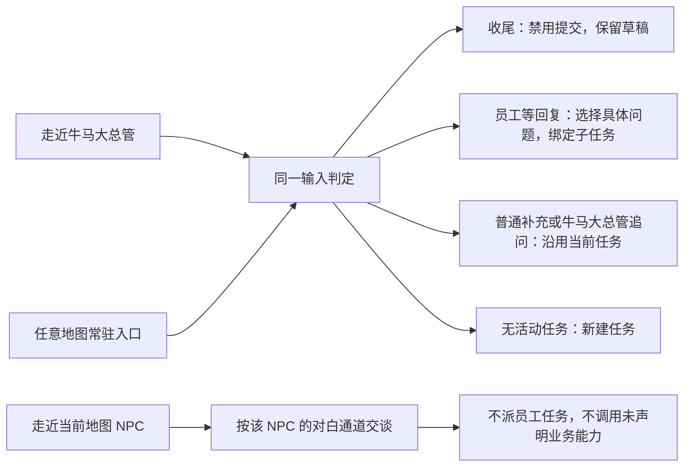

# 机制流程图

这些图说明主要分支，不替代 YAML 的状态与条件。规则正文分别在 [任务协议](./task_protocol.yaml)、[角色状态机](./agent_fsm.yaml)、[地图规则](./map_rules.yaml)、[NPC规则](./npc_rules.yaml)与[交互规则](./interaction_rules.yaml)。

## 世界与地图

办公楼与咖啡店没有直连，必须经室外商业街往返。街道无所属建筑，其余商业立面只作陈设；道路表现不增加交通玩法。两条连接仍为未启用的设计数据，须完成各自两端入口、到达格与返程验证后才能启用。老板可跨图；在外图时常驻牛马大总管入口仍然可用。三位特殊NPC不为追随老板跨图，无法到老板身边时说明位置限制，真实任务继续。新增4位普通职员只做预写对白、坐姿和职责附近可见活动，不进入staff或子任务流程。

加载过程中不再触发第二次切图，不新建、不暂停业务任务，也不把迟到的NPC回复显示到另一个人的对话里。

## 牛马大总管派活与顺序协作

只有下游需要的真实材料齐全，且不依赖尚未发生的采用或发布，外部待办材料才可用于后续步骤。失败重试成功后可以完成原目标；失败历史仍保留，不把每次失败都永远累计成“部分完成”。额度不足时明示未完成目标。

## 老板补充要求

新输入与终态提交须原子判定。带着旧任务ID的草稿不能自动变成新任务；取消和超时收尾须保存未处理输入并明确未执行。

## 两个牛马大总管入口与 NPC 交流

普通NPC对白不等于员工业务Agent接入。角色不在当前地图、通道不可用或正在切图时，不打开就近输入；常驻牛马大总管入口继续依照任务状态工作。
