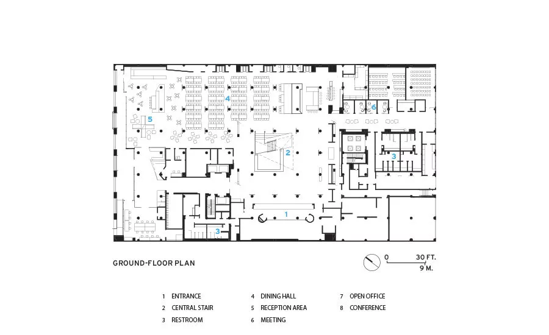
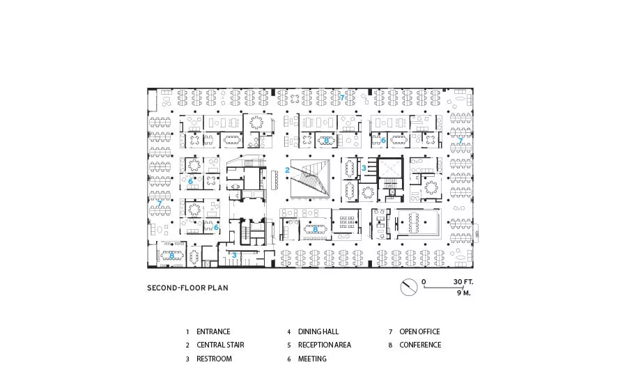

# 现代科技办公室布局参考

研究日期：2026-09-13。用于牛马-老板办公楼的白色简约科技风翻新，仅提出空间组织参考，不修改游戏机制、岗位数量、NPC 人设或业务能力。

建议先用一条偏轴主通路连接入口与公共节点，将 9 个开发工位分簇放到主要采光侧；前台、洽谈靠入口，老板室与 HR 在较安静的一侧，卫生间从侧通路进入。房间和桌组按用途取不同面积，不排成四个对称象限。白色基底、浅灰分界、玻璃与少量绿植是本项目指定的视觉方向，不是以下公司的统一外观。

## 来源与核验范围

采用三个真实科技公司办公室的设计方官方项目正文。案例描述的是对应项目设计，不代表这些公司在 2026 年仍按当年布局使用办公楼。媒体转载和搜索结果中的设计解读没有作为本报告的事实依据。

| 案例 | 一手来源 | 本轮实际取得的内容 |
| --- | --- | --- |
| Google Headquarters，Mountain View，2005 | [Clive Wilkinson Architects 官方项目](https://clivewilkinson.com/portfolio_page/google-headquarters/) | 项目说明、面积与年代；专注工作区和玻璃三人工作室的组织方式 |
| Dropbox，San Francisco | [Rapt Studio 官方项目](https://raptstudio.com/work/dropbox/) | 中央公共目的地、外围工作邻里、图书休憩空间及空间识别说明 |
| Pinterest HQ，San Francisco，2016 | [IwamotoScott 官方项目](https://www.iwamotoscott.com/projects/pinterest-san-francisco)；[Architectural Record 具名项目图纸](https://www.architecturalrecord.com/articles/11803-pinterest-hq) | 官方项目正文，以及标注由 IwamotoScott Architecture 提供的首层和二层平面；两张原图已实际打开查看 |

Googleplex 官方旧 PDF 当前返回404，未将其索引中的Figure 9当成已查看图纸。按用户允许的具名设计方供图范围，本轮补看了 Architectural Record 发布、明确署名由 IwamotoScott Architecture 提供的 Pinterest 首层与二层平面；原图和直接来源如下。图纸版权归其原权利人，只用来理解空间关系，不照抄为游戏地图或交付素材。

## 已实际查看的 Pinterest 平面图

项目页分别标注“Ground floor plan”“Second floor plan”及“Image courtesy IwamotoScott Architecture”。本轮已打开原图，而不是只读取图片标题。[供图出处](https://www.architecturalrecord.com/articles/11803-pinterest-hq)

- 首层图可见：入口1先进入较开敞的公共厅，中心楼梯2形成方向节点；接待5和餐厅4在公共空间一侧，卫生间3成组落在侧边核心区，会议6位于另一侧，不让入口动线先穿工位。
- 二层图可见：开放工位7沿外围连续布置，中心楼梯附近留出主交通；内层会议6和会议室8大小、开闭形态交错，卫生间3依附核心区。工作簇与封闭房间的尺度不同，层次由用途形成。
- 对本项目的推导：单层游戏不复制楼梯和中庭，把“公共入口—主交通—外围工作簇—封闭支路房间”压成一条偏轴主通路。9席开发区占较大连续一侧，前台与洽谈处于入口公共面，老板室/HR在安静支路，卫生间接侧通路；鱼缸和书架用作本项目要求的识别节点。

原图直链：[首层平面](https://www.architecturalrecord.com/ext/resources/Issues/2016/August/building-type-studies/1608-The-Workplace-IwamotoScott-Architecture-San-Francisco-Pinterest-HQ-15.webp?t=1469458490&width=1080)、[二层平面](https://www.architecturalrecord.com/ext/resources/Issues/2016/August/building-type-studies/1608-The-Workplace-IwamotoScott-Architecture-San-Francisco-Pinterest-HQ-16.webp?t=1469458524&width=1080)。不依据这两张图猜本项目房间米制尺寸、坐标或排水位置。

## 1. Google：专注工位成组，共享设施独立组织

**来源事实。** 官方项目说明把高度专注的软件工程工作区与学习、会议、休闲和餐饮设施结合，利用原有内庭院与建筑外壳。为外围工作房间设计的玻璃三人工作室配吸声顶棚，目标是同时保留专注工作的私密性、采光和视野。[官方项目说明](https://clivewilkinson.com/portfolio_page/google-headquarters/)

**本项目可借鉴的布局。** 9 个开发工位可拆成三个可辨识的小组，放在办公楼较大的连续工作带内；组间用低柜、玻璃片段或绿植形成层次。主通路从工作带边缘经过，避免所有人前往洽谈室、卫生间都必须穿过桌椅间隙。这里的“三组”是对游戏规模的推导，不照搬 Google 的封闭三人房间。

**不照搬。** 不把其办公管理模式、餐饮设施或大型园区规模写成游戏需求。老板室、HR、行政和 9 个开发工位来自本项目任务，不是这个案例要求的功能。

## 2. Dropbox：让公共空间成为路标，工位远离干扰

**来源事实。** Rapt 将项目组织为有不同特征的工作邻里：咖啡公共空间成为中心目的地，工作区安置在外围。设计方指出旧有嘈杂走廊及工作、协作空间处理过于相同带来干扰；新布局利用地标和目的地帮助辨识各组工作区，普通工位区可保持中性、简洁。项目另有独立图书休憩空间。[官方项目说明](https://raptstudio.com/work/dropbox/)

**本项目可借鉴的布局。** 入口接待、书架休憩点和鱼缸可形成几个小而清楚的空间路标，不必把每个角落做成主题房间。书架宜在休息凹位或公共通路一侧，鱼缸贴接待等候区的墙边；两者周围留可站立空间，不侵占入口和主通道。开发桌组与这些公共节点之间保留缓冲。

**不照搬。** Dropbox 的深色专注室、粉色图书馆及娱乐功能不是本次视觉方案。我们只借鉴目的地与安静工作区的关系，颜色仍遵循本项目的白色简约科技风。鱼缸是本项目需求，不能声称来自该案例。

## 3. Pinterest：入口先接待，开敞与封闭空间交错

**来源事实。** 官方正文将沿街一跨设计为入口界面，容纳门厅、接待、咖啡及公共活动相关空间。工作层由内向外形成层次：中庭周边是社交与主交通，最外围安排利用自然光的工位，中间为开敞、封闭交错的会议和休憩空间；玻璃转角保留部分斜向视线。[官方项目正文](https://www.iwamotoscott.com/projects/pinterest-san-francisco)

**本项目可借鉴的布局。** 从入口进入先看见行政前台和中文公司招牌，再到等候与洽谈室；来访动线不必经过 9 个开发座位。洽谈室、老板室和 HR 采用大小不同、位置错开的封闭或玻璃房间，旁边留出开放休憩凹位。可以保留视线联系，但不要为了透明而取消房间的识别和遮挡关系。

**不照搬。** 游戏保持单层与四向移动，不复制其四层中庭、楼梯或建筑体量。已查看的平面只用于理解开闭空间与交通关系，游戏按自己的需求重新组织。

## 给本项目的第一版布局建议

下面全部是基于任务要求和上述空间关系形成的项目建议，未替代正式作者地图、碰撞与岗位定义。

| 要求 | 建议位置与关系 | 需要保留的空间 |
| --- | --- | --- |
| 行政前台、中文公司招牌 | 入口偏一侧；招牌在前台后方墙面，入门即可辨认 | 前台前的接待站位与进入主通路的开口分开 |
| 洽谈室 | 靠近前台，但入口错开，不正堵楼门 | 来访者从前厅到洽谈室不穿开发工位带 |
| 9 个开发工位 | 放在较大的连续采光侧，分成可辨识的小组；最终逐席数出 9 套桌、椅和设备 | 每席有可到达站位；桌后通行与主通路分别考虑 |
| 老板室 | 安静端或后侧角部，面积不与洽谈室机械等分 | 大总管的门外岗位和门洞分开，主通路能到达 |
| HR | 靠洽谈侧或安静支路，和开发大区保持清楚边界 | 房门前有停留格；不据房间新增审核或招聘业务 |
| 卫生间 | 边缘服务带，由短侧通路进入；入口与前台、开发桌组视线错开 | 独立门前缓冲与清楚中文标识；本建议不推断真实工程排水位置 |
| 书架、鱼缸、绿植 | 书架在公共休憩凹位；鱼缸作前厅识别点；绿植用于组间和墙角收边 | 不遮中文招牌、不占门洞、不用大件硬堵通道 |

不对称应来自真实用途：开发区占最大连续面积，前台与等候占较浅的前场，洽谈室和老板室大小不同，HR 与卫生间接侧通路。不要只把桌子随机错位来制造不对称，也不要用隔墙把唯一回路切断。

视觉上以白色墙面和桌面为主，浅灰地面区分走道与办公区，玻璃边框、设备和中文招牌保留足够深色轮廓。书架木色、鱼缸蓝绿与植物作为少量识别点；这些是本项目的美术选择，不宣称是三个案例共有的实景材料。

本报告完成三个设计方正文案例与两张具名设计方平面图的查看和布局推导。房间具体格数、9 席坐标、门前站位、服务域、遮挡和可达性仍需在项目作者布局中单独验证；没有根据参考案例擅自增加 NPC、业务规则或游戏实现。
